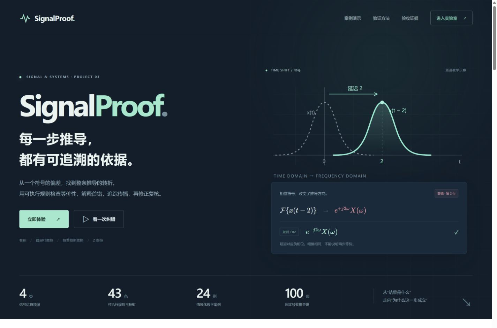

# SignalProof · 信号推导步骤验证与最小错因定位

面向高级编程课程的完整工程：用受限数学语法和可执行符号规则检查信号推导，逐步说明依据，定位最早已确认错误，并提供局部修正建议。Python 核心同时服务于命令行和浏览器实验室；交付包含源码、固定测试与逐步标签、性能测量、实验报告和迭代记录。

**[项目首页](https://zhangzhi-666.github.io/signalproof-demo/)** · [在线实验室](https://zhangzhi-666.github.io/signalproof-demo/lab.html) · [24 道教学案例](https://zhangzhi-666.github.io/signalproof-demo/lab.html#cases) · [实验报告](https://zhangzhi-666.github.io/signalproof-demo/docs/experiment-report.html) · [GitHub 源码](https://github.com/zhangzhi-666/signalproof-demo)



## 项目实现

| 课程任务 | 对应实现 |
| --- | --- |
| 表达式解析、AST 与标准化 | 白名单解析器，保留原始分母，校验变量、初值和参数条件 |
| 四类运算的规则库 | 卷积、Fourier、单边 Laplace、双边 Z；40 条领域性质及 3 条已声明变换对映射 |
| 相邻步骤验证 | 符号等价、有界规则重写、遵守题设条件的数值反例；证据不足保留未知 |
| 首错与错因定位 | 目标行编号、首错确定性、错误传播、候选式与局部结构差异 |
| 公式与教学展示 | LaTeX 预览、独立 ROC、规则路径、图形示意、修正后复核与报告导出 |
| 可复现实验 | 100 条固定推导、独立逐步标签、32 条追加回归、原始 JSON/CSV 测量 |

24 道教学案例按领域、难度和题型筛选，每题提供题意、提示、易错点和验证后复盘。它们与正式验收集分别组织，不合并计算独立题目数量。

## 快速运行

需要 **Python 3.10 或更新版本**。在仓库根目录执行，安装脚本创建 `.venv`，仅使用 `runtime/` 中自带且版本固定的 SymPy/mpmath wheel，不访问包索引。

```powershell
python tools/setup.py
.\.venv\Scripts\python.exe -m engine serve --port 8080
```

浏览器打开 [本地首页](http://127.0.0.1:8080/)，按 `Ctrl+C` 停止服务。不要用 `file://` 直接打开页面，Worker 和运行时资源需要 HTTP。macOS/Linux 使用 `.venv/bin/python` 替代上述解释器路径；无需激活虚拟环境。

浏览器版无需 API Key。所有数学计算在本机 Worker 中执行，公式不会发往大模型；运行时、数学字体随仓库提供，无需第三方 CDN。首页轻量加载，首次进入实验室才下载约 20 MB 的数学运行资源。

## 命令行与 Python 接口

```powershell
# 检查一条故意包含相位符号错误的推导，输出 JSON 诊断
.\.venv\Scripts\python.exe -m engine verify examples/fourier-shift.json --pretty

# 用于自动检查：只有整链已验证正确才以 0 退出
.\.venv\Scripts\python.exe -m engine verify examples/z-complete.json --require-correct

# 保存诊断、生成公式预览、查看规则目录
.\.venv\Scripts\python.exe -m engine verify examples/z-complete.json --output build/result.json --pretty
.\.venv\Scripts\python.exe -m engine format examples/z-complete.json --pretty
.\.venv\Scripts\python.exe -m engine catalog --pretty
```

`verify`、`format`、`catalog` 默认超时 15 秒，可设置 `--timeout`。普通 `verify` 的退出码 0 表示计算完成，并不表示公式正确；加入 `--require-correct` 后，非正确结论返回 1。输入/执行错误返回 2，超时返回 3。超时有独立 `timedOut` 标识，不当作数学错误或正确证明。

```python
from engine import verify

result = verify(
    ["LT(D(x(t),t),t,s)", "s*X(s)-2"],
    {"initial": {"x0": 2}},
)
print(result["status"], result["firstError"])
```

Python 函数签名为 `verify(steps, c=None)`；直接调用不附带进程超时。请求结构、状态与字段说明见 [API 文档](docs/API.md)。

## 输入约定

编辑区和 CLI 使用显式计算语法；LaTeX 是自动生成的展示格式，不是输入语言。

```text
FT(x(t-2),t,w)
exp(-2*I*w)*X(w)
```

```text
ZT((1/2)^n*u(n),n,z)
z/(z-1/2); ROC: abs(z)>1/2
```

使用 `*` 表示乘法、`^` 或 `**` 表示幂、`I` 或 `j` 表示虚数单位。Fourier 使用角频率核 `exp(-I*w*t)`；Laplace 从 `0-` 开始并保留初值；Z 使用双边约定，序号为整数。每条推导 2–16 行，解析器另设字符数、AST 节点数和嵌套深度限制。

## 实测结果与复现

随附测量来自 **Windows 11 / CPython 3.12.14 / SymPy 1.13.3**，共运行 3 轮。准确率按每个案例首次测量统计；时延统计全部重复中已完成的验证调用。

| 指标 | 固定验收集 | 追加组合与边界回归集 |
| --- | ---: | ---: |
| 独立推导数 | 100（50 正确 + 50 错误） | 32 |
| 相邻步骤数 | 110 | 41 |
| 步骤状态匹配 | 110/110（100%） | 41/41（100%） |
| 整链状态匹配 | 100/100（100%） | 32/32（100%） |
| 错误链首错定位 | 50/50（100%） | 7/7（100%） |
| 平均每链验证时间 | 103.998 ms | 98.720 ms |
| 超时 / 重复间不一致案例 | 0 / 0 | 0 / 0 |

时延包含解析、规则与符号计算、诊断和公式输出，排除进程启动、导入、预热、IPC、浏览器下载与页面渲染。**这是固定样本上的原生 Python 测量，不能推断任意数学表达式的泛化准确率，也不是浏览器响应速度。** 标签由 AI 辅助构建并独立核对，运行前固定，未经外部人员认证，不属于盲测数据集。

```powershell
.\.venv\Scripts\python.exe -m unittest discover -s tests -v
.\.venv\Scripts\python.exe tools/benchmark.py --repeats 3 --output docs/benchmark-results.json
.\.venv\Scripts\python.exe tools/generate_report.py
```

基准程序会保留超时和失败，不从准确率分母中删除；记录源码及数据哈希、每次调用、混淆统计和重复一致性。源代码或数据变化后应先重跑测量，再生成报告。GitHub Actions 在 Windows、Linux 上执行回归测试、CLI 样例与 JavaScript 语法检查。

- [实验报告](docs/experiment-report.html)：设计、方法、实测结果、失败说明与规则附录，可打印为 PDF。
- [原始 JSON](docs/benchmark-results.json) / [逐次 CSV](docs/benchmark-results.csv)：完整测量记录。
- [固定验收数据](data/tests.json) / [逐步标签及理由](data/step-oracles.json) / [追加回归](data/holdout.json)：预先确定的期望结果。
- [自评与迭代记录](docs/review-record.json)：复现问题、修复及验证证据；自评不等于教师评分。

## 工程结构

```text
engine/
  syntax.py          语法白名单、AST、分母与条件校验
  rules.py           可执行规则、匹配与有界重写
  diagnostics.py     等价检查、ROC、合法反例与局部差异
  verification.py    相邻步骤、首错确定性与错误传播
  formatting.py      LaTeX 表达式与收敛域排版
  service.py         稳定调度接口与规则目录
  __main__.py        CLI、子进程超时与本地静态服务
data/                固定测试、独立标签、追加回归与教学案例
examples/            可直接调用的 JSON 请求
tests/               单元、数学、安全与测量指标回归
tools/               离线环境安装、基准测量、报告生成
docs/                实验报告、API、自评与原始测量
index.html           项目展示首页
lab.html / app.js     验证实验室与交互界面
worker.js            浏览器中的 Python 引擎加载与调度
runtime/ / katex/     随附的数学运行时、渲染器与字体
```

## 能力边界

数值抽样仅用于寻找符合题设条件的反例，抽样一致不构成证明。未满足前提、能力之外的变换或未能完成的证明会保留 `unknown`；必要 ROC 缺失单列为 `incomplete`。形式规则仍以相关变换或卷积存在、题设一致为前提。

“最小错因”指相对于搜索所得候选的局部结构差异，不保证所有等价推导中的全局最小编辑或解释唯一。修正只作用于首个已确认错误行，之后必须复核整条推导。图形是性质示意，不冒充任意输入信号的数值仿真。系统不识别自然语言证明、任意 LaTeX 或手写图片。

## GitHub Pages 与第三方组件

仓库根目录可直接作为静态站点发布，无需构建：在 **Settings → Pages** 选择 **Deploy from a branch → main / (root)**。保留 `.nojekyll`、`engine/`、`data/`、`runtime/` 和 `katex/`；相对路径支持 GitHub Pages 项目子目录。Python CLI 在本地运行，GitHub Pages 负责提供浏览器静态文件。

实现采用 HTML/CSS/JavaScript、Web Worker、Pyodide 0.27.7、SymPy 1.13.3、mpmath 1.3.0 与 KaTeX 0.16.22。原始第三方许可证随组件提供，详见 [第三方说明](THIRD_PARTY_NOTICES.md)。本仓库未额外授予项目自身的开源许可证。
