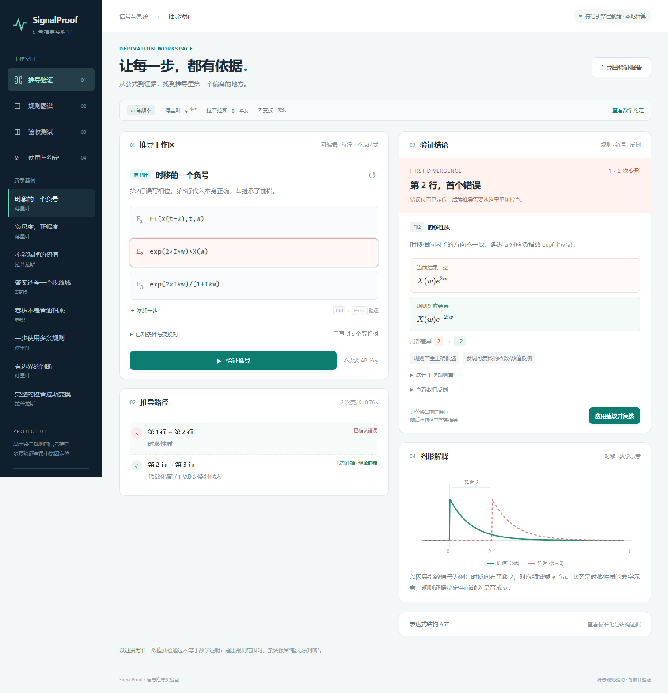

# SignalProof · 信号推导实验室

一个可在浏览器中运行的《信号与系统》推导检查 Web Demo：验证每一步，定位最早确认的错误，并给出规则依据、局部差异与修正建议。

**[打开在线 Demo](https://zhangzhi-666.github.io/signalproof-demo/)** · [源代码仓库](https://github.com/zhangzhi-666/signalproof-demo)



## 体验内容

- 卷积、傅里叶、单边拉普拉斯与双边 Z 变换。
- 40 条领域规则 + 3 条已声明变换对映射，均有可执行匹配与重写。
- 逐步验证、首错定位、错误传播提示和最小不匹配子树。
- 初值、参数条件、收敛域检查；支持“暂无法判断”。
- 修正后复核、图形提示、AST、规则搜索和报告导出。
- 50 条正确链 + 50 条错误链，测试台实际调用同一符号引擎。

无需 API Key；计算在浏览器 Worker 中运行。数学运行时和字体已随项目提供，公式不会发送给大模型。

## GitHub Pages 发布

本目录就是可直接发布的静态站点，支持 `https://用户名.github.io/仓库名/` 这样的项目子路径。

1. 将本目录内容提交到一个 GitHub 仓库的 `main` 分支根目录。
2. 打开仓库 **Settings → Pages**。
3. Source 选择 **Deploy from a branch**，选择 **main / (root)** 并保存。
4. 等待 Pages 部署完成，打开 GitHub 显示的正式地址。

请保留根目录的 `.nojekyll`、`runtime/`、`katex/`、`engine/` 和 `data/`。无需额外构建步骤。首次打开需要下载约 20 MB 的数学与排版资源。

## 本地运行

在仓库根目录执行：

```sh
python -m http.server 8080
```

打开 `http://localhost:8080`。不要使用 `file://` 直接打开 HTML，因为浏览器 Worker 和资源加载需要 HTTP。

## 输入示例

```text
FT(x(t-2),t,w)
exp(2*I*w)*X(w)
```

该例把时移相位的负号写成正号。正确形式为 `exp(-2*I*w)*X(w)`。

```text
ZT((1/2)^n*u(n),n,z)
z/(z-1/2); ROC: abs(z)>1/2
```

使用显式乘号 `*`；幂支持 `^` / `**`，虚数单位支持 `I` / `j`。支持 `Conv`、`D`、`Int0`、`delta`、`u` 与界面说明列出的函数。

## 测试与范围

交付前浏览器实测主验收 100/100，通过的错误链首错位置为 50/50。完整记录见 [测试结果](docs/test-results.json)。页面测试台可以重新运行，不使用预设通过率。

Fourier 采用角频率核 `exp(-I*w*t)`；Laplace 从 `0-` 开始；Z 采用双边约定。数学输入范围有限，不支持任意 LaTeX、自然语言证明或手写识别。数值抽样一致不等于证明；条件不足、超出规则范围或超时时保留未知。

“最小错因”指相对已验证候选的局部结构差异，不保证解释唯一。图形是教学示意。固定验收通过率不代表任意表达式的泛化准确率。

## 实现与第三方组件

原生 HTML/CSS/JavaScript + Web Worker + Pyodide 0.27.7 + SymPy 1.13.3 + KaTeX 0.16.22。

原始第三方许可证随组件提供，见 [第三方说明](THIRD_PARTY_NOTICES.md)。本仓库未额外授予项目自身的开源许可证。
